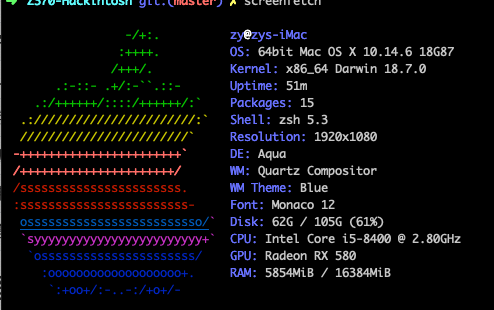
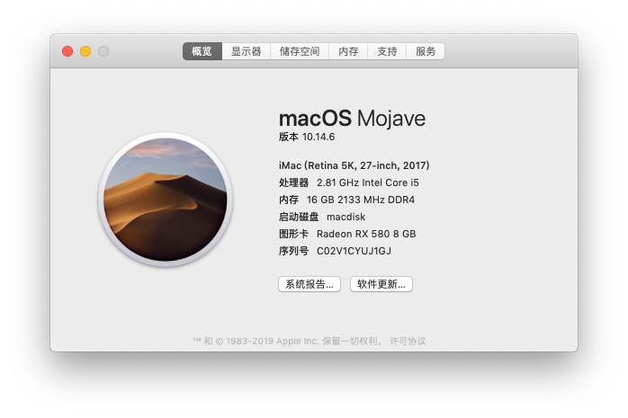
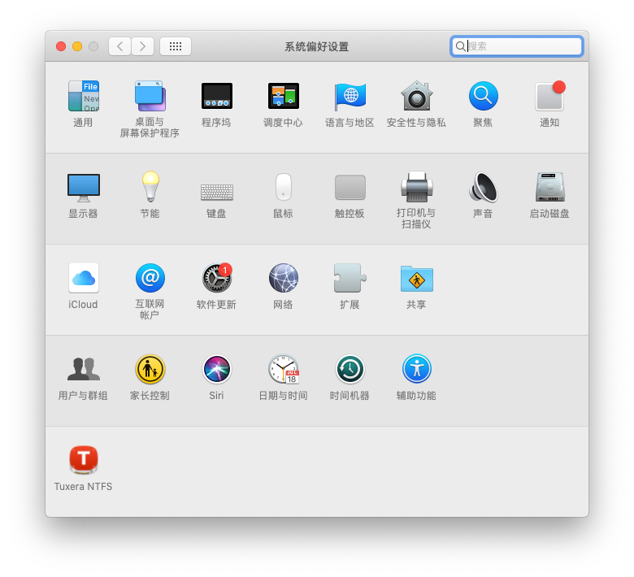

## 硬件配置

| 硬件 | 配置                                           |
| ---- | ---------------------------------------------- |
| CPU  | I5-8400                                        |
| 内存 | 美商海盗船(CM4X8GE2400C16K4) DDR4-2400-8GB  X2 |
| 主板 | MSI Z370-OC-PRO                                |
| 显卡 | RX580 8G 2304SP                                |
| 硬盘 | HP EX900 250G+希捷2T                           |

## 截图

